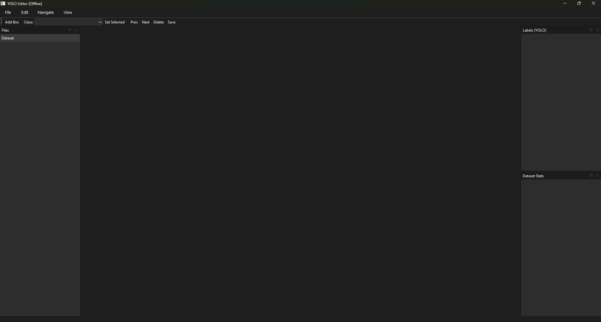
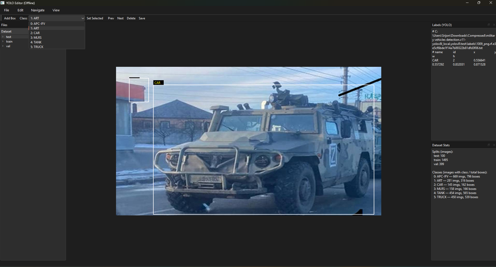
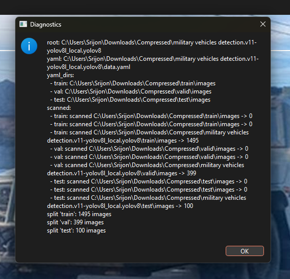

# YOLO Editor (Offline Desktop)
*A fast, offline desktop tool to view, edit, validate, and remap YOLOv8 labels — built by **Srijon Basak**.*

> **Why this exists**  
> I kept hitting friction during label QA: tools that break on unusual folder layouts, YAMLs that point one level off (`../train/images`), GUIs that only show class IDs (not names), and lag/crashes with large datasets. I wanted a **portable, zero-cloud** app that “just works” with any YOLOv8 dataset.

---

## 📷 Screenshots

> Put your images in `assets/` and update the names if needed.

---

## ✨ Highlights

- **Open anything**
  - Open a **dataset root** *or* a **`data.yaml`** directly.
  - Handles all common layouts (and quirky ones):
    - `images/<split>/*` + `labels/<split>/*`
    - `<split>/images/*` + `<split>/labels/*`
    - `<split>/*.(jpg|png|…)` + `<split>/labels/*.txt`
    - `valid` alias for `val`
    - Smart fallbacks if YAML paths are off (e.g., `../train/images` when folders are adjacent to the YAML)
- **Edit labels quickly**
  - Add boxes (drag), **move**, **resize via corner handles**, **delete**.
  - Change selected boxes to the current class.
  - Saves to YOLO txt (normalized **cx cy w h**) safely/atomically.
  - Always shows **class names** (from YAML) next to IDs.
- **Navigate fast**
  - Arrow keys ← / → (or **P / N**) for prev/next.
  - Fit to window (**F**), 100% zoom (**1**), rubber-band selection.
- **Know your data**
  - Per-split image counts.
  - Per-class coverage (#images) and #boxes—spot class imbalance fast.
- **Merge-ready (extension)**
  - Class remapping (e.g., 13 → 7 classes) & export to a clean output dataset (dir layout + updated YAML).

---

## 🧱 Supported Dataset Layouts

All of these work:

A) images/<split> and labels/<split>
root/
  images/
    train/ *.jpg
    val/   *.jpg
    test/  *.jpg
  labels/
    train/ *.txt
    val/   *.txt
    test/  *.txt

B) <split>/images and <split>/labels
root/
  train/
    images/ *.jpg
    labels/ *.txt
  val/
    images/ *.jpg
    labels/ *.txt
  test/
    images/ *.jpg
    labels/ *.txt

C) Images directly inside split, labels inside split/labels
root/
  train/ *.jpg
  train/labels/*.txt
  val/   *.jpg
  val/labels/*.txt

D) YAML-driven (Ultralytics style, including 'valid' alias and odd ../ paths)
root/
  data.yaml
  train/...
  valid/... or val/...
  test/...
YAML example (Ultralytics):

    yaml
    Copy code
    train: ../train/images
    val: ../valid/images
    test: ../test/images
    nc: 6
    names: ['APC-IFV', 'ART', 'CAR', 'MLRS', 'TANK', 'TRUCK']
    If those ../ paths don’t match your structure, the app auto-fallbacks to neighbors (e.g., tries train/images next to the YAML). Use File → Show Dataset Diagnostics to see exactly what it resolved and scanned.

⌨️ Shortcuts
Add box: A

Delete selected: Delete

Change selected to current class: C

Save labels: S

Previous/Next image: ← / → or P / N

Fit to window: F

100% zoom: 1

🛠️ Install & Run (from Source)
Recommended build/runtime: Python 3.11 on Windows 64-bit.

powershell
Copy code
        # 1) Create and activate a venv (PowerShell)
        python -m venv .venv
        # If activation is blocked:
        Set-ExecutionPolicy -Scope Process -ExecutionPolicy Bypass
        .\.venv\Scripts\Activate.ps1

        # 2) Install deps
        pip install -r requirements.txt

        # 3) Launch the app
        python -m yolo_editor.app
If you’re on Python 3.13 and hit a NumPy/OpenCV binary mismatch, pin:

powershell
Copy code
        pip install "opencv-python==4.9.0.80"
📦 Build a Windows .exe
Option A: PyInstaller (One-dir build recommended)
Create a tiny launcher in project root:

python
        Copy code
        # launcher.py
        from yolo_editor.app import main
        if __name__ == "__main__":
            main()
Build:

powershell
Copy code
        # Clean build venv (recommended):Error calling Python override of QGraphicsView::keyPressEvent(): Traceback (most recent call last):
  File "C:\Users\Srijon\Documents\Projects\yolo_editor\yolo_editor\ui\merge_designer\canvas.py", line 455, in keyPressEvent
    self.canvas.delete_selection()
    ~~~~~~~~~~~~~~~~~~~~~~~~~~~~^^
  File "C:\Users\Srijon\Documents\Projects\yolo_editor\yolo_editor\ui\merge_designer\canvas.py", line 324, in delete_selection
    self._recalc_all_targets()
    ~~~~~~~~~~~~~~~~~~~~~~~~^^
  File "C:\Users\Srijon\Documents\Projects\yolo_editor\yolo_editor\ui\merge_designer\canvas.py", line 262, in _recalc_all_targets
    for blk in node.blocks:
               ^^^^^^^^^^^
AttributeError: 'bool' object has no attribute 'blocks'
:
  File "C:\Users\Srijon\Documents\Projects\yolo_editor\yolo_editor\ui\merge_designer\canvas.py", line 455, in keyPressEvent
    self.canvas.delete_selection()
    ~~~~~~~~~~~~~~~~~~~~~~~~~~~~^^
  File "C:\Users\Srijon\Documents\Projects\yolo_editor\yolo_editor\ui\merge_designer\canvas.py", line 323, in delete_selection
    self._remove_target(tid)
    ~~~~~~~~~~~~~~~~~~~^^^^^
  File "C:\Users\Srijon\Documents\Projects\yolo_editor\yolo_editor\ui\merge_designer\canvas.py", line 349, in _remove_target
    self._recalc_all_targets()
    ~~~~~~~~~~~~~~~~~~~~~~~~^^
  File "C:\Users\Srijon\Documents\Projects\yolo_editor\yolo_editor\ui\merge_designer\canvas.py", line 262, in _recalc_all_targets
    for blk in node.blocks:
               ^^^^^^^^^^^
AttributeError: 'bool' object has no attribute 'blocks'
 Python 3.11
        py -3.11 -m venv .venv-build
        .\.venv-build\Scripts\Activate.ps1
        pip install --upgrade pip
        pip install -r requirements.txt
        pip install pyinstaller==6.11

        # Build (onedir)
        pyinstaller ^
        --name "YOLO Editor" ^
        --windowed ^
        --icon assets/app.ico ^
        --collect-all PySide6 ^
        --collect-submodules cv2 ^
        launcher.py
Result:

text
Copy code
        dist\YOLO Editor\YOLO Editor.exe
One-file build is possible (--onefile) but starts slower (unpacks to temp). For end users, ship onedir inside an installer.

Option B: Installer (Inno Setup)
Create installer.iss:

ini
Copy code
        [Setup]
        AppName=YOLO Editor
        AppVersion=0.1.1
        DefaultDirName={autopf}\YOLO Editor
        DefaultGroupName=YOLO Editor
        OutputDir=installer
        OutputBaseFilename=YOLO-Editor-Setup
        Compression=lzma
        SolidCompression=yes
        ArchitecturesInstallIn64BitMode=x64

        [Files]
        Source: "dist\YOLO Editor\*"; DestDir: "{app}"; Flags: recursesubdirs

        [Icons]
        Name: "{group}\YOLO Editor"; Filename: "{app}\YOLO Editor.exe"
        Name: "{commondesktop}\YOLO Editor"; Filename: "{app}\YOLO Editor.exe"; Tasks: desktopicon

        [Tasks]
        Name: "desktopicon"; Description: "Create a &desktop icon"; GroupDescription: "Additional icons:"
        Build in Inno Setup → get:

        text
        Copy code
        installer\YOLO-Editor-Setup.exe
        On fresh Windows boxes, Qt may require the Microsoft Visual C++ Redistributable (x64).

🚀 Usage
Open a dataset

File → Open Dataset Root… (pick folder containing train/, val/valid/, and/or test/), or

File → Open Dataset YAML… (pick your data.yaml).

Browse images from the left Files tree.

Add a box (A), drag corners to resize, drag box to move.

Pick a class from the dropdown, press C to set selected boxes to that class.

Delete selected with Delete.

Save anytime (S). Labels are written atomically (via *.tmp then replace).

Right side shows:

Labels (YOLO): exact file path + rows with name, id, cx, cy, w, h

Dataset Stats: per-split image counts; per-class images & total boxes

Diagnostics:
File → Show Dataset Diagnostics prints detected YAML path(s), resolved directories, and “scanned” lines with counts—great when paths are weird.

🔁 Class Remapping (merge two datasets)
Planned/extension module; concept already designed:

Define a mapping (e.g., 13 original classes → 7 final classes).

Unused classes map to drop (e.g., -1) or a fallback class.

Batch apply mapping across splits; rewrite all label files.

Export a new dataset folder with:

remapped label txt files,

copied/linked images (configurable),

updated data.yaml with nc and names.

🧩 Tech Notes
PySide6 (Qt) for native UI/graphics scene

OpenCV for robust image IO (RGB conversion)

PyYAML for YAML parsing

Crash-safe image loading: .copy() the QImage to avoid lifespan issues when wrapping NumPy buffers

Robust path resolver: tries primary YAML, then smart fallbacks (relative to YAML, stripping ../, canonical neighbors), and supports multiple split layouts

🐞 Troubleshooting
App closes immediately → run from PowerShell to see traceback:

powershell
Copy code
        python -m yolo_editor.app
Common fixes:

Ensure deps installed: pip install -r requirements.txt

On Python 3.13, pin OpenCV: pip install "opencv-python==4.9.0.80"

“No images detected” → use Show Dataset Diagnostics. Check:

The train/val/test paths it resolved

Whether it scanned …/images or the split folder itself

If YAML has ../, verify actual folder structure (fallbacks may fix automatically)

Qt platform plugin error (in packaged exe) → build with --collect-all PySide6.

OpenCV import error → include --collect-submodules cv2 in PyInstaller command.

Can’t activate venv (execution policy) →
Set-ExecutionPolicy -Scope Process -ExecutionPolicy Bypass

📄 License
r
Copy code
        MIT License — Copyright (c) 2025 Srijon Basak
👤 Author
        Built by Srijon Basak — srijonbasak76@gmail.com.
Found a bug or want a feature? Open an issue or reach out!

makefile
Copy code
        ::contentReference[oaicite:0]{index=0}
